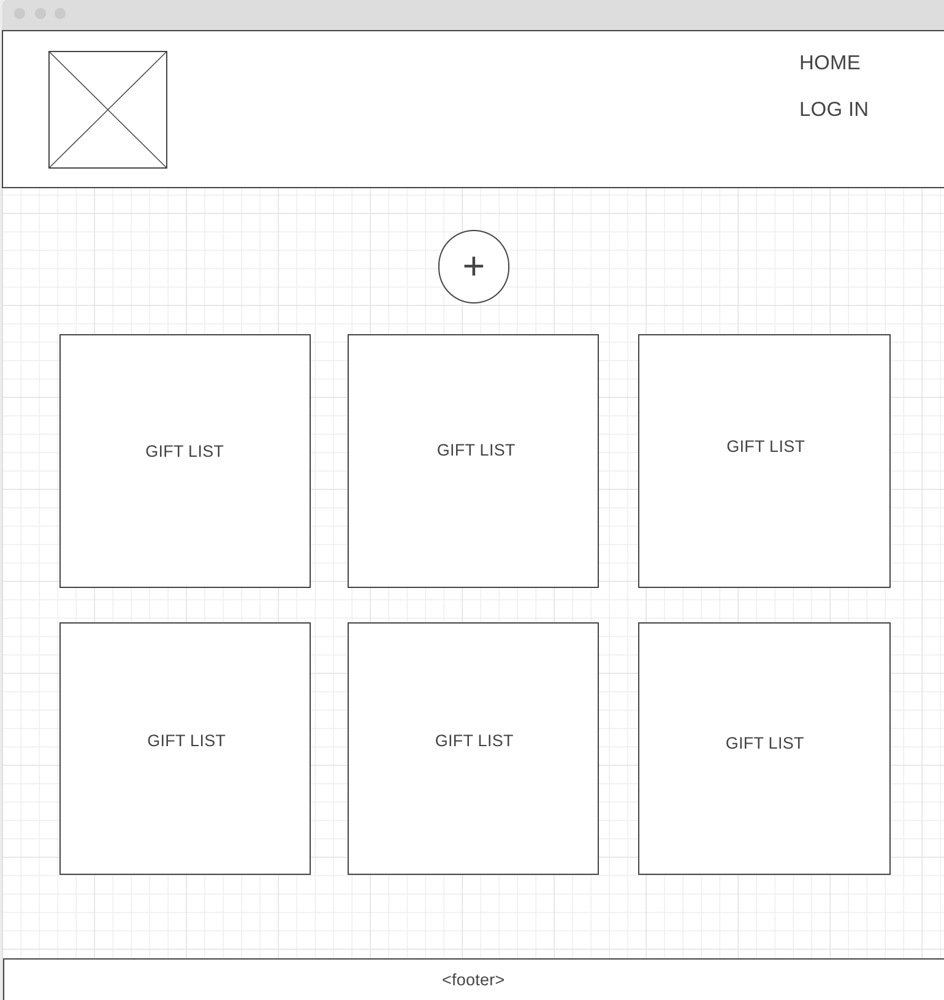
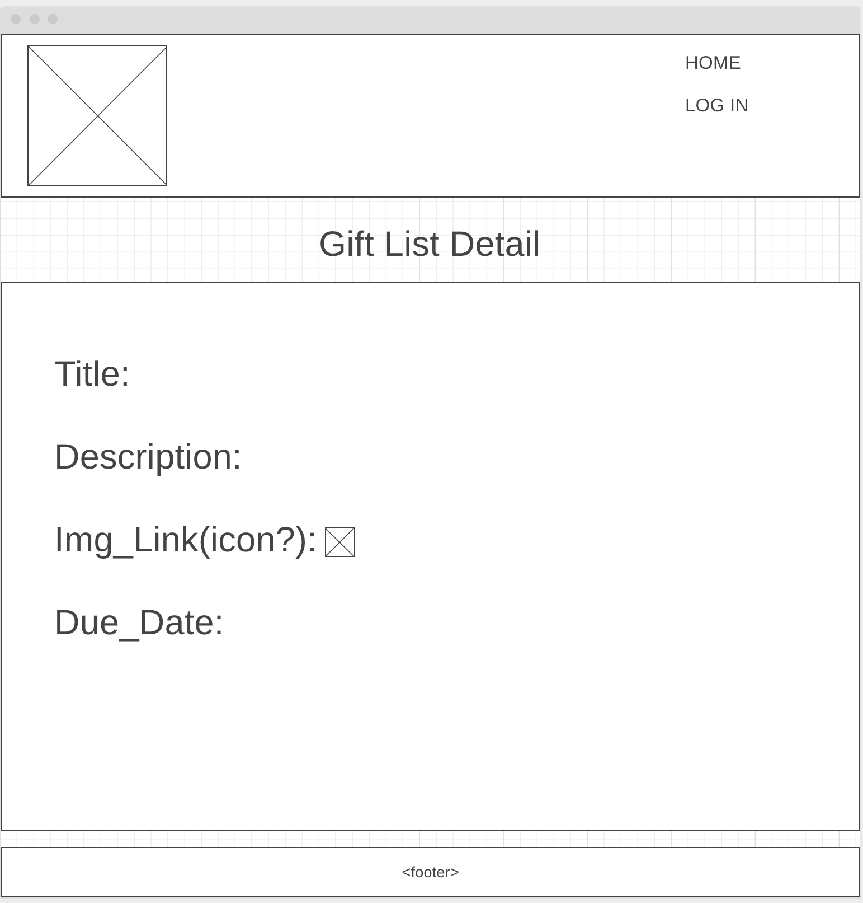

Components:
About - About this app page.
Header - Header of the app.
Footer - Footer of the app.
Home - main home page.
LoginForm - login page.
RegisterForm - Register page.
GiftList - This is the list of gift lists.
GiftListDetails - This is the details of a gift list.
CreateGiftListForm - Create a new Gift list.
UpdateGiftListForm - update a gift list.
GiftDetails - Details of a gift.
CreateGift - creates a new gift.
UpdateGift - edits a Gift.

Routes:
/giftlists - get all
/giftlists/:id - create, update, delete
/giftlists/:id/gifts - get gifts by giftlist
/giftlists/:giftListId/gifts/:giftId - create, update and delete gift(giftListId is irrelevant for update and delete)

Models:
User
GiftList
Gift

# GiftBox 

#### Buying a gift for friends, family memebers, partners, etc.. can be confusing especially if you're having a hard time remembering what you bought. 

#### This app will make it so it's easier for planing out buying gift for whomever. No more re-gifting items to the people you care about

## Challeneges
#### Having the login features works(Webbing id's to users), saving any information.

#### CRUD Working

#### GIT GROUP Mangement

## MVP

#### User being able to sign in, be greeted.

#### Create gift-list(have the event title, date of event, a small description for the event and an image for the events)

#### Update gift-list

#### Delete gift-list

#### Create gifts(image, price description, location, actual/proposed purchase date)

#### Update gifts

#### Delete gifts

## Post-MVP
#### Users will have the ability to share list with other users.

## Additional Items:
### Components:
#### About - About this app page.
#### Header - Header of the app.
#### Footer - Footer of the app.
#### Home - main home page.
#### LoginForm - login page.
#### RegisterForm - Register page.
#### GiftList - This is the list of gift lists.
#### GiftListDetails - This is the details of a gift list.
#### CreateGiftListForm - Create a new Gift list.
#### UpdateGiftListForm - update a gift list.
#### GiftDetails - Details of a gift.
#### CreateGift - creates a new gift.
#### UpdateGift - edits a Gift.

## Routes:
#### /giftlists
#### /giftlists/:giftListId/gifts/

## Models:
#### User
### GiftList
#### Gift

## ERD

## WireFrame

zita - testing
